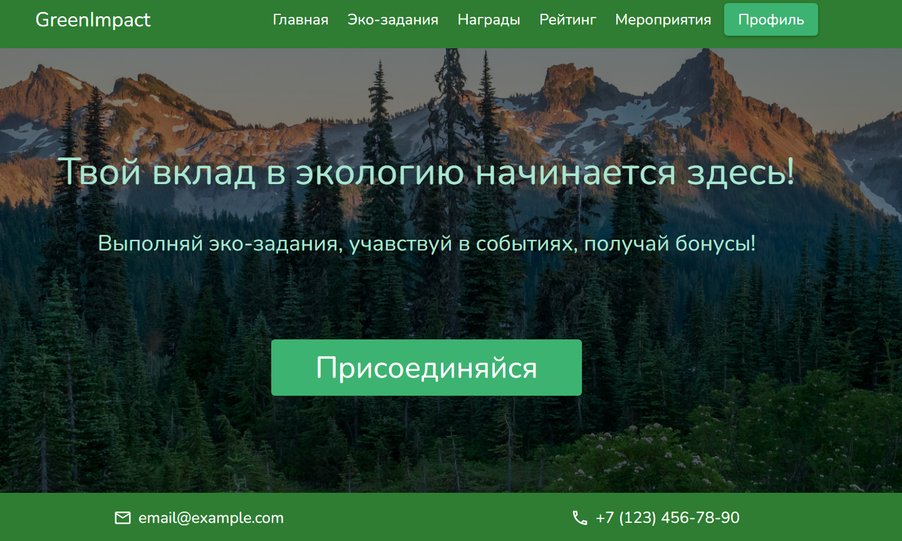
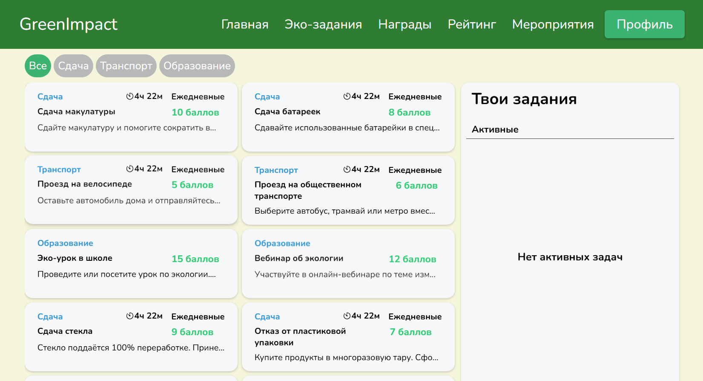
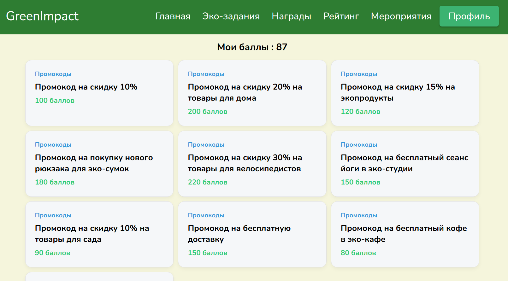
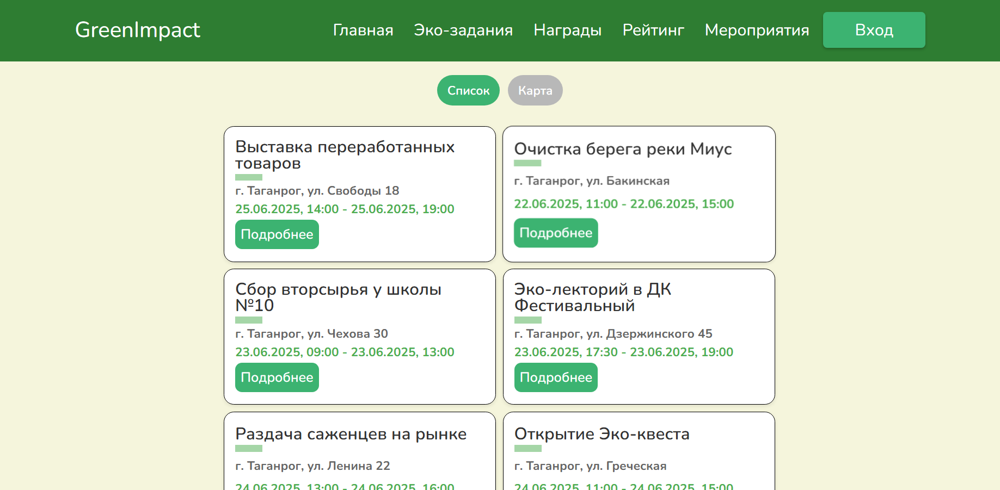
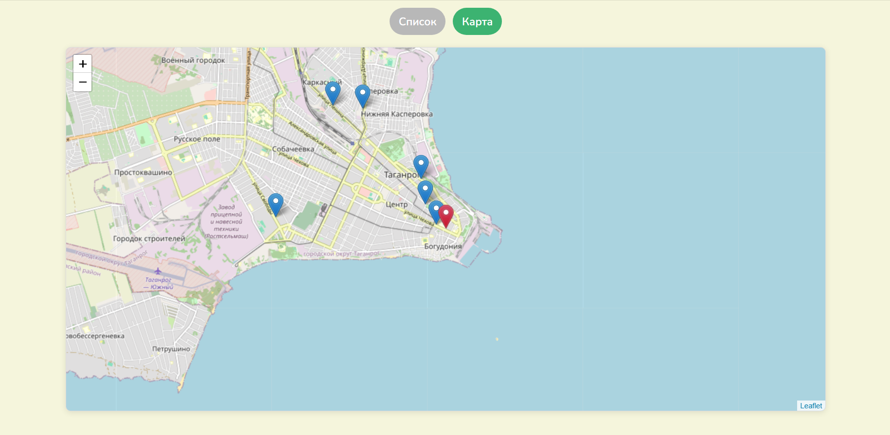
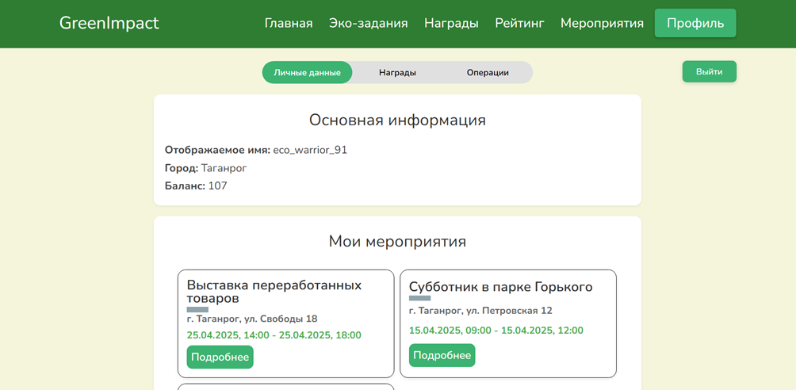
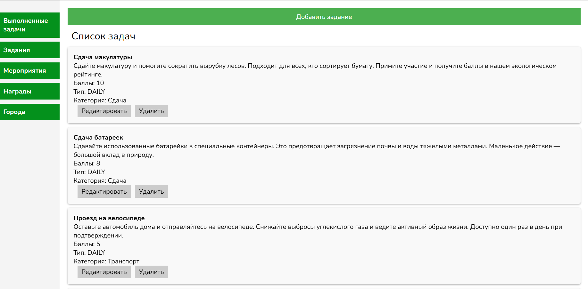
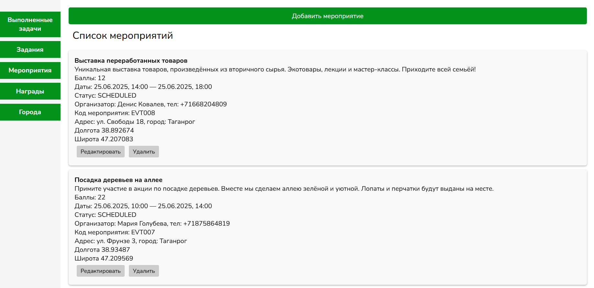
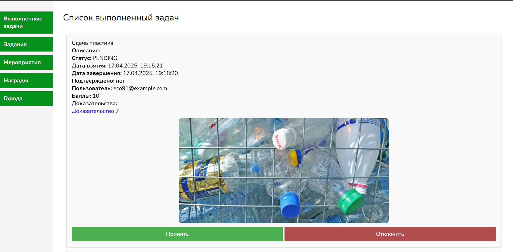

# GreenImpact — Frontend

# О проекте

GreenImpact — это frontend часть веб-приложения для мотивации и отслеживания экологичных действий. Пользователи могут регистрироваться, участвовать в эко-событиях, накапливать баллы и получать награды.

## Технологии

- React 19
- Vite
- Redux Toolkit
- React Router 7
- Axios
- Leaflet + React Leaflet
- JWT Decode
- React Toastify
- SCSS / Sass

## Основные возможности

- Просмотр экологических заданий
- Участие в экологических мероприятиях
- Система баллов и наград
- Рейтинг пользователей
- Профиль пользователя
- Панель администратора для управления заданиями и мероприятиями

## Интерфейс приложения

### Главная страница



### Список экологических заданий



### Система наград



### Мероприятия




### Профиль пользователя



### Админ-панель





## Установка и запуск

### Сборка и настройка frontend-приложения

1. Cклонируйте репозиторий

```bash
git clone https://github.com/discovery126/green-impact-frontend.git
cd green-impact-frontend
```

2. Установите зависимости:

```bash
npm install
```

3. Создайте файл .env в корне проекта со следующими основными параметрами:

```env
VITE_GREENIMPACT_API_URL=http://localhost:8080/api/v1
```

4. Запустите проект:

```bash
npm run dev
```

После запуска проект будет доступен по адресу, указанному в терминале (по умолчанию http://localhost:5173).

## ℹ️ Примечание

Данный frontend предназначен для взаимодействия с backend-приложением, исходный код которого расположен в отдельном репозитории.
Для корректной работы и полноценного тестирования рекомендуется использовать оба репозитория совместно.

👉[Перейти к backend-репозиторию](https://github.com/discovery126/green-impact-api)
